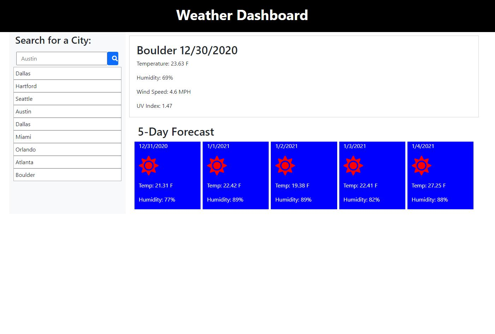

# Weather Dashboard

## Description

This weather application is used for searching cities around the world.  After inputing a city the user will receive back the current weather and the 5 day forecast. Included in the information is the city name & date.  As well as the temperature, the humidity, the wind speed, and the UV index.  Green, yellow, or red will outline the UV index value to indicate the favorability of the current weather conditions.  A list of recent searches will be compiled to the left of the screen.  

## Developer 

The application uses HTML, CSS, and JavaScript with jQuery as the JS library.  This is the first application I have created using an AJAX method for making server side API calls.  There are still a couple bugs that need to be worked out.  When clicking on the history list of searches the weather details stacks on top of the previous data instead of replacing it.  I also was not able to get my icons to dynamically update depending on current/future weather conditions.  I did enjoy working with AJAX and look forward to seeing what I will be able to create in the futrue.
 

Link for application: [Weather Dashboard](https://dbridgman1.github.io/Weather-Dashboard/)

## Fucntionality

## Bugs and Issues
Found a bug? Review any [open issues][open-issues] or create a [new issues here][new-issue] so we can fix it for you!

## License
This application does not hold any licenses.

[open-issues]: https://github.com/dbridgman1/Weather-Dashboard/issues
[new-issue]: https://github.com/dbridgman1/Weather-Dashboard/issues/new